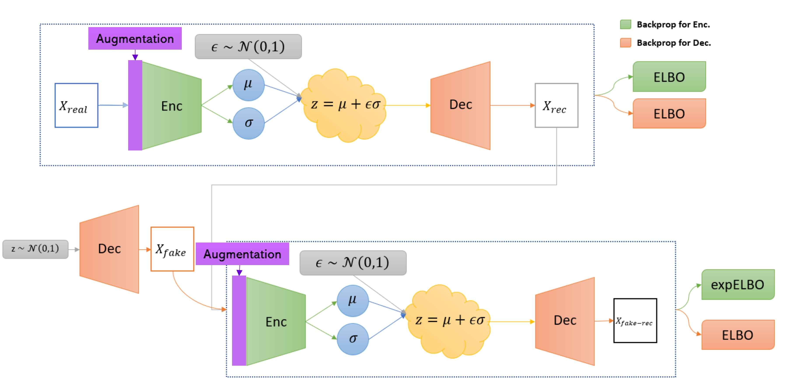

# augmentation-enhanced-Soft-Intro-VAE
In this project we researched the effect of regularizations and augmentations on the Soft-Introspective VAE presented in ["Soft-IntroVAE: Analyzing and Improving the Introspective Variational Autoencoder." by Daniel, Tal, and Aviv Tamar](https://arxiv.org/abs/2012.13253), in order to improve its generation ability. Using differentiable augmentations (implemented with [kornia](https://kornia.github.io/)) on both real and fake data which also act as a regularization, we managed to improve the FID score reported in the paper of 4.30 on the CIFAR-10 dataset, to a score of 2.96.  

This repository contains the implementation of the different methods we used integrated with the code from the [official repository](https://github.com/taldatech/soft-intro-vae-pytorch/tree/main/soft_intro_vae).  

Project created by: [Yuval Baruch](https://github.com/baruch1192) & [Dan Haramati](https://github.com/DanHrmti)

  

> **General Description:** *The recently introduced Soft Introspective Variational Auto-Encoder (Soft-IntroVAE) is an explicit deep generative model that enjoys the good traits of variational auto-encoders (VAEs) and generative adversarial networks (GANs) by proposing a variational-based approach to adversarial training, and it exhibits outstanding performance in various tasks such as density estimation, image generation and more. However, in adversarial training, it is quite common that the discriminatory module (discriminator in GANs, encoder in Soft-IntroVAE) may overfit at some point to the training data, preventing further improvements for the generative module (generator in GANs, decoder in Soft-IntroVAE). In this project, we researched and implemented different data augmentations and regularization methods with the aim of improving the Soft-Intro VAE model in terms of generation quality on the CIFAR-10 dataset. We achieved our best results using differentiable augmentations on both real and fake data which also act as a regularization and managed to improve the FID score from 4.30 to 2.96 on the CIFAR-10 dataset, further narrowing the gap between VAE based models and GANs. We include our method’s theoretical and empirical justification as well as an analysis of the exact source of our significant improvement. In addition, we present results on downstream tasks our model can be useful for as a consequence of being trained with augmented data.*

[augmentation-enhanced-Soft-Intro-VAE](#augmentation-enhanced-soft-intro-vae)
  1. [Datasets](#datasets)
  2. [Training](#training)
  3. [Method Overview](#method-overview)
  4. [Results](#results)
      * [Generation](#generation)
      * [Reconstruction](#reconstruction)
      * [Interpolation in the Latent Space](#interpolation-in-the-latent-space)
  5. [Files and Directories in the Repository](#files-and-directories-in-the-repository)
  6. [Credits](#credits)

## Datasets
We used the [CIFAR-10](https://www.cs.toronto.edu/~kriz/cifar.html) dataset to optimize and evaluate our model on.  
For the evaluation and analysis we also used [MNIST](http://yann.lecun.com/exdb/mnist/) which is more simple and structured than CIAFR-10.

## Training 

`main.py --help`

You should use the `main.py` file with the following arguments:

|Argument                   | Description                                                                   |Legal Values             |
|---------------------------|-------------------------------------------------------------------------------|-------------------------|
|`-h`, `--help`                 | shows arguments description             		                                  | 			                  |
|`-d`, `--dataset`              | dataset to train on 				               	                                  |str: 'cifar10', 'mnist', 'fmnist', 'svhn', 'monsters128', 'celeb128', 'celeb256', 'celeb1024'	|
|`-n`, `--num_epochs`	          | total number of epochs to run			                                            | int: default=250        |
|`-z`, `--z_dim`                | latent dimensions										                                          | int: default=128        |
|`-s`, `--seed`                 | random state to use. for random: -1 				                                  | int: -1 , 0, 1, 2 ,.... |
|`-v`, `--num_vae`              | number of iterations for vanilla vae training 				                        | int: default=0          |
|`-l`, `--lr`                   | learning rate 												                                        | float: defalut=2e-4     |
|`-r`, `--beta_rec`             | beta coefficient for the reconstruction loss                                  | float: default=1.0      |
|`-k`, `--beta_kl`              | beta coefficient for the kl divergence							                          | float: default=1.0      |
|`-e`, `--beta_neg`             | beta coefficient for the kl divergence in the expELBO function                | float: default=256.0    |
|`-g`, `--gamma_r`              | coefficient for the reconstruction loss for fake data in the decoder		      | float: default=1e-8     |
|`-b`, `--batch_size`           | batch size 											                                              | int: default=32         |
|`-p`, `--pretrained`           | path to pretrained model, to continue training	 	                            | str: default="None"	    |
|`-c`, `--device`               | device: -1 for cpu, 0 and up for specific cuda device						              | int: default=-1         |
|`-f`, `--fid`                  | if specified, FID wil be calculated during training				                    | bool: default=False     |
|`--gn_real_sigma`              | standart deviation for gaussian noise added to real data 				              | float: defalut=0.0      |
|`--nn_sigma_enc`               | size of relative standard deviation of in-layer gaussian noise in the encoder | float: defalut=0.0      |
|`--nn_sigma_dec`               | size of relative standard deviation of in-layer gaussian noise in the decoder	| float: defalut=0.0      |
|`--nn_gn_rel`                  | if specified, inlayer guassian noise std will be a learned parameter				  | bool: default=True      |
|`--p_enc_s`                    | dropout probability after the first layer in the encoder				              | float: defalut=0.0      |
|`--p_enc_e`                    | dropout probability after the last layer in the encoder				                | float: defalut=0.0      |
|`--p_dec_s`                    | dropout probability after the first layer in the decoder				              | float: defalut=0.0      |
|`--p_dec_e`                    | dropout probability after the last layer in the decoder				                | float: defalut=0.0      |
|`--drop_dis`                   | if specified, Dropout will be disable in the other module during training			| bool: default=False     |
|`--p_augment`                  | data augmentation probability in each augmentation layer				              | float: defalut=0.0      |
|`--p_ls_enc`                   | label switch percentage per batch in encoder training  		                    | float: defalut=0.0      |
|`--p_ls_dec`                   | label switch percentage per batch in decoder training				                  | float: defalut=0.0      |

**Command with recommended hyperparameters**:

CIFAR-10 - `python main.py --dataset cifar10 --device 0 --lr 2e-4 --num_epochs 1000 --beta_kl 1.0 --beta_rec 1.0 --beta_neg 256 --z_dim 128 --batch_size 32 --p_augment 0.5`

MNIST -    `python main.py --dataset mnist --device 0 --lr 2e-4 --num_epochs 500 --beta_kl 1.0 --beta_rec 1.0 --beta_neg 256 --z_dim 32 --batch_size 128 --p_augment 0.5`

**Notes**:
* Our best experiment was with `--p_augment 0.5`, but you can experiment with the other methods as well.
* The optimizer uses a step scheduler for the learning rate, the milestone is set to epoch 350.
* During training:
    * figures of samples and reconstructions are saved locally.
    * statistics are printed (reconstruction error, KLD, expELBO).
    * at the end of each epoch, a summary of statistics will be printed.
    * FID can be calculated only on 3 channels images (rgb)
* Tips:
    * KL of fake/rec samples should be >= KL of real data.
    * It is usually better to choose `beta_kl` >= `beta_rec`.
    * FID calculation is not so fast, so turn it off if you don't care about it. 
* The baseline model code supports additional datasets that we did not optimize our method for.

## Method Overview
The code in this repository includes implementations of several adjustable regularization methods:
* Dropout in different layers of the encoder and decoder
* Gaussian noise added to the original data or to intermediate layers of the encoder and decoder.
* Label switching (Real <-> Fake)
* Differentiable data augmentations

## Results
All of the results can be conveniently reproduced using the provided `S_IntroVAE_Analysis.ipynb` notebook by loading trained models from checkpoints and running the relevant cells.

<h4 align="center">
    
</h4>

|                       | Baseline | Ours | SOTA (June 2021) |
|-----------------------|----------|------|------------------|
| FID score on CIFAR-10 | 4.30     | 2.96 | 2.10             |

### Generation

### Reconstruction

### Interpolation in the Latent Space

## Files and Directories in the Repository

| Folder  |File name                          | Purpose                                                                                       |
|---------|-----------------------------------|-----------------------------------------------------------------------------------------------|
|main     |`environment.yml`                  | environment file |                                                                            |
|training |`main.py`                          | main application for training augmentation enhanced Soft-Intro VAE                            |
|         |`dataset.py`                       | holds functions that manage the datasets                                                      |
|         |`train_soft_intro_vae.py`          | builds and trains the model                                                                   |
|         |`metrics`                          | folder which contains 2 measurs for generation quality: `fid_score.py`, `inception.py`        |
|analysis |`S_IntroVAE_Analysis.ipynb`        | interactive notebook for loading model from checkpoint and producing results                  |
|figures  |`generation_examples.jpg`          | images generated by our model                                                                 |
|         |`image_inpainting_CIFAR10.jpg`     | performance example in inpainting task on CIFAR-10                                            |
|         |`image_inpainting_MNIST.jpg`       | performance example in inpainting task on MNIST                                               |
|         |`image_interpolation_CIFAR10.jpg`  | interpolation between 2 images from CIFAR-10 performed in latent space                        |
|         |`image_interpolation_MNIST.jpg`    | interpolation between 2 images from MNIST performed in latent space                           |
|         |`image_reconstruction_CIFAR10.jpg` | examples for the reconstruction quality of our model on CIFAR-10                              |
|         |`image_reconstruction_MNIST.jpg`   | examples for the reconstruction quality of our model on MNIST                                 |
|         |`model_structure.jpg`              | structure of the model                                                                        |
|         |`where_to_augment.jpg`             | shows different augmentation approches in an adversarial setting                              |

## Credits
* [Daniel, Tal, and Aviv Tamar. "Soft-IntroVAE: Analyzing and Improving the Introspective Variational Autoencoder." Proceedings of the IEEE/CVF Conference on Computer Vision and Pattern Recognition. 2021.](https://arxiv.org/abs/2012.13253)

